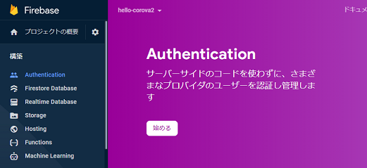
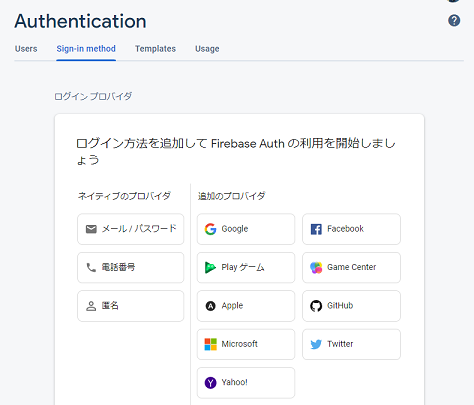
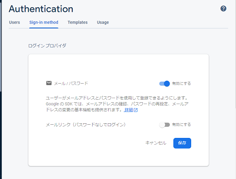
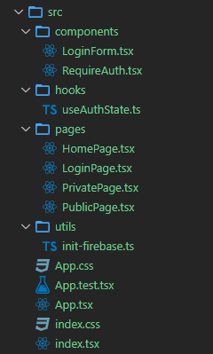
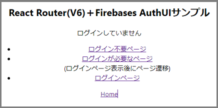
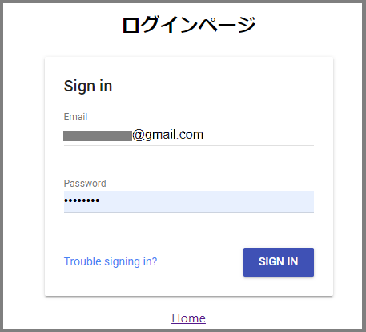
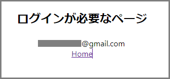
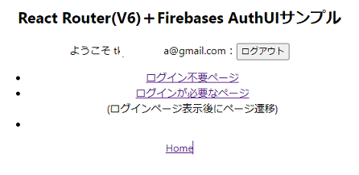

# React Router V6とFirebase 認証(react-firebaseui,react-firebase-hooks)の使い方

React Router(V6) とFirebase Authenticationを組み合わせて、特定ページに認証をかけるサンプルです。
react-firebase-hooksというカスタムフックを使うことで、ReduxやContextが不要になり簡単に実装ができるようになります。

## 目的、機能

1. React Router V6で画面遷移を行う
1. 認証をFirebaseで行う(メール認証)
1. ログイン画面は`react-firebaseui`を利用する(楽をする)
1. ログインが必要な画面をラップするコンポーネント`<RequireAuth>`を用意する(`<PrivateRoute>`代替。Routeをラップするコンポーネントは利用できなくなっています)
```jsx
  <Route path="/private" element={
      <RequireAuth>
        <PrivatePage />
      </RequireAuth>
    } />
```
5. ログイン状態はフックで管理する(ReduxやContexは不要。react-firebase-hooksを利用する)
  ```tsx
    const {isLoading, isSignedIn, email, userId} = useAuthState();
  ```
6. 画面を閉じた際、認証の(継続|継続しない)を切り替え可能とする

# 概要手順
## React, firebaseのインストール

ログイン画面のUI用`react-firebaseui`、認証用`react-firebase-hooks`も一緒にインストールします

```bash
npm i react-router-dom
npm i firebase react-firebaseui react-firebase-hooks
```

## Firebaseコンソールから、メール認証を有効化

* 左側メニューから`Authentidation`を選択し、`始める`ボタンをクリック



* ログイン方法の`メール/パスワード`をクリック



* クリックで認証を有効にする



## ファイル一覧と概要

https://github.com/murasuke/firebase-auth



|  ファイル名  |  概要  |
| ---- | :---- |
|  .env  |  Firebaseの接続設定と、認証の永続化設定  |
|  init-firebase.ts  |  FirebaseApp初期化ロジック  |
|  index.tsx  |  init-firebaseを読み込み、初期化を実行  |
|  useAuthState.ts  |  ユーザーのサインイン状態を取得するためのカスタムフック  |
|  LoginForm.tsx  | react-firebaseuiを利用したログインフォーム  |
|  RequireAuth.tsx  |  認証が必要なページをラップすることで、認証を強制するコンポーネント  |
|  App.tsx  |  ルート定義  |
|  HomePage.tsx  |  トップページ。各画面へのリンクと、ログアウト機能  |
|  LoginPage.tsx  |  ログインページ。ログイン後に表示するパスを引数で受け取る  |
|  privatePage.tsx  |  表示にログインを必要とするページ  |
|  PublicPage.tsx  |  表示にログインが不要なページ   |


## 画面イメージ

トップページ(`HomePage.tsx`)

`ログインが必要なページ`をクリックすると、ログインページに遷移します



ログイン画面(`LoginPage.tsx`)、UIは`react-firebaseui`を利用



ログイン後、自動で`ログインが必要なページ`(`PirvatePage.tsx`)へ遷移



ログイン済みでトップページを開いた場合の画面。




# 実装方法


## Firebaseの初期化：utils/init-firebase.ts

初期化に必要な情報を環境変数から読み込み、初期化を実行します。
```tsx
import { initializeApp } from 'firebase/app';
import { getAuth, browserSessionPersistence } from 'firebase/auth';

// FirebaseApp初期化
initializeApp({
  apiKey: process.env.REACT_APP_APIKEY,
  authDomain: process.env.REACT_APP_AUTHDOMAIN,
  projectId: process.env.REACT_APP_PROJECTID,
  storageBucket: process.env.REACT_APP_STORAGEBUCKET,
  messagingSenderId: process.env.REACT_APP_MESSAGINGSENDERID,
  appId: process.env.REACT_APP_APPID,
});

const persisit = process.env.REACT_APP_AUTH_PERSISIT ?? '0';

if (persisit === '0') {
  // ログインを継続しない
  getAuth().setPersistence(browserSessionPersistence);
}
```

初期化を最初に1回だけ行うため、`index.tsx`のimportで読み込みます。

```tsx
import React from 'react';
import ReactDOM from 'react-dom';
import { BrowserRouter } from 'react-router-dom';
import './index.css';
import App from './App';
import './utils/init-firebase';

ReactDOM.render(
  <React.StrictMode>
    <BrowserRouter>
      <App />
    </BrowserRouter>
  </React.StrictMode>,
  document.getElementById('root'),
);
```


環境変数設定(.env)

Firebaseのキーはアプリ側で保持するため、環境変数に入れる必要はありません。
かと言ってもソースに直接記載すると誰でも利用できてしまうので.envに設定しています。

```sh
# Firebase 設定
REACT_APP_APIKEY=XXXXXXXXXXXXXXXXXXXXXXXXXXXXXXXXXXXXXXX
REACT_APP_AUTHDOMAIN=XXXXXXXXXXXXXXXXX.firebaseapp.com
REACT_APP_PROJECTID=XXXXXXXXXXXXXXXXX
REACT_APP_STORAGEBUCKET=XXXXXXXXXXXXXXXXX.appspot.com
REACT_APP_MESSAGINGSENDERID=99999999999
REACT_APP_APPID=1:99999999999:web:XXXXXXXXXXXXXXXXXXXXXX


# 0: ログイン状態を継続しない(ブラウザを閉じるとログイン解除)
# 1: ログインを継続
REACT_APP_AUTH_PERSISIT=1
```

## 認証チェックコンポーネント：components/RequireAuth.tsx

認証情報を取得するフック(`useAuthState`)を利用し、認証状態であれば子コンポーネントを、
未認証状態であれば、ログインコンポーネントを返します。
React Router(V6)用です。

```tsx
import { useAuthState } from 'hooks/useAuthState';
import LoginPage from 'pages/LoginPage';

/**
 * 認証が必要なページをラップすることで、認証を強制するコンポーネント
 * ・未ログインの場合、ログインページを先に割り込ませてから該当コンポーネントを表示する。
 */
const RequireAuth = ({ children }: { children: JSX.Element }) => {
  const { isSignedIn, isLoading } = useAuthState();
  if (isLoading) {
    return <></>;
  }
  return isSignedIn ? children : <LoginPage />;
};

export default RequireAuth;
```

## ルート定義：App.tsx

認証が必要なページを`<RequireAuth>`で囲います。認証していない場合、ログイン画面に遷移します。
(ReactRouterV6)
```tsx
<Routes>
  <Route path="/" element={<HomePage />} />
  <Route path="/public" element={<PublicPage />} />
  <Route path="/private" element={<RequireAuth>
                                    <PrivatePage />
                                  </RequireAuth>} />
  <Route path="/signin" element={<LoginPage moveTo="/" />} />
</Routes>
```


## 認証情報取得フック：/hooks/useAuthState.ts

`react-firebase-hooks/auth`のラッパーです。認証状態の判断をわかりやすくするため`isSignedIn`フラグを追加しています。

```tsx
/**
 * 認証情報取得フック
 * react-firebase-hooks/authを使いやすくするためのラッパーフック。
 * ・AuthState型のオブジェクトを返します(ログイン済みフラグ、ユーザ情報、ローディング中フラグ)
 * ・ログイン状態は`react-firebase-hooks/auth`が管理しているため、ContextやReduxは不要
 */

import { useEffect, useState } from 'react';
import { getAuth } from 'firebase/auth';
import { useAuthState as useAuthStateOriginal } from 'react-firebase-hooks/auth';

/**
 * useAuthState フックの戻り値の型。
 */
export type AuthState = {
  isSignedIn: boolean; // ログイン状態フラグ
  isLoading: boolean; // 読み込み中フラグ
  userId?: string;
  userName?: string;
  email?: string;
  error?: Error;
};

/**
 * useAuthState が返す初期値。
 */
const INITIAL_AUTH_STATE: AuthState = {
  isSignedIn: false,
  isLoading: true,
  userId: undefined,
  userName: undefined,
  email: undefined,
};

/**
 * ユーザーのサインイン状態を取得するためのカスタムフック。
 * react-firebase-hooks/authをラップしている。
 */
export const useAuthState = (): AuthState => {
  const [authState, setAuthState] = useState(INITIAL_AUTH_STATE);
  const [user, loading, error] = useAuthStateOriginal(getAuth());
  useEffect(() => {
    if (user) {
      setAuthState({
        isSignedIn: true,
        isLoading: loading,
        userId: user.uid,
        userName: user.displayName || undefined,
        email: user.email || undefined,
        error,
      });
    } else {
      setAuthState({ ...INITIAL_AUTH_STATE, isLoading: loading });
    }
  }, [user, loading, error]);

  return authState;
};
```


## useAuthSateフックの使い方サンプル：pages/PublicPage.tsx

ログイン済みの判断には`isSignedIn`を利用します。

```tsx
import { VFC } from 'react';
import useAuthState from 'hooks/useAuthState';

/**
 * 表示にログインが不要なページ
 */
const PublicPage: VFC = () => {
  const { isLoading, isSignedIn, email } = useAuthState();
  if (isLoading) {
    return <p>Loadiing...</p>;
  }

  return (
    <>
      <h2>ログイン不要ページ</h2>
      <div>{isSignedIn ? `ログイン済み:${email}` : `未ログイン`}</div>
    </>
  );
};

export default PublicPage;

```

## ログイン画面：components/LoginForm.tsx

ログインUI自体は、`react-firebaseuiコンポーネント`を利用して表示しています。
ここでは、UIコンポーネントの利用に必要な認証プロバイダの設定を行います。

* ログイン成功時のリダイレクト先を指定する`signInSuccessUrl`を使うと、ブラウザ側でアプリのリロードが発生してしまうため、自力でページ遷移を行います。

  `signInSuccessWithAuthResult`(ログイン成功後)イベント発生時に、navigate()でページ遷移する


```tsx
import { VFC } from 'react';
import { useNavigate } from 'react-router-dom';
import {
  getAuth,
  EmailAuthProvider,
  // FacebookAuthProvider,
  // GoogleAuthProvider,
  // TwitterAuthProvider,
} from 'firebase/auth';
import { auth } from 'firebaseui';
import StyledFirebaseAuth from 'react-firebaseui/StyledFirebaseAuth';

// ログインフォームの設定(メール認証以外にも複数設定可能)
//   複数選択した場合は、ログイン方法の選択画面が表示されます。
const uiConfig: auth.Config = {
  signInFlow: 'popup',
  signInOptions: [
    EmailAuthProvider.PROVIDER_ID,
    // FacebookAuthProvider.PROVIDER_ID,
    // GoogleAuthProvider.PROVIDER_ID,
    // TwitterAuthProvider.PROVIDER_ID,
  ],
  // signInSuccessUrl:"", リダイレクト(reactアプリのリロード)が発生するため利用しない
};

/**
 * react-firebaseuiを利用したログインフォーム
 */
const LoginForm: VFC<{ moveTo?: string }> = ({ moveTo }) => {
  const navigate = useNavigate();
  // signInSuccessUrlを設定すると、リダイレクトが発生してReact自体がリロードしてしまう。
  // ⇒リダイレクト防止のため、navigateで遷移する。
  //   <RequireAuth>で認証のチェックをしている場合は、useAuthState()フックでコンポーネントが切り替わるため、callbackでの切り替え不要(moveToを空白にしておく)
  const callbacks: auth.Config['callbacks'] = {
    signInSuccessWithAuthResult: (authResult, redirectUrl) => {
      if (moveTo) {
        navigate(moveTo);
      }
      return false;
    },
  };

  // ログイン画面(react-firebaseui)
  return (
    <StyledFirebaseAuth
      firebaseAuth={getAuth()}
      uiConfig={{ ...uiConfig, callbacks }}
    />
  );
};

export default LoginForm;
```

## ログアウト：pages/HomePage.txx

ログイン状態の場合、ログアウトボタンを表示します。

```tsx
const HomePage: VFC = () => {
  const { isLoading, isSignedIn, email } = useAuthState();

  return (
    <>
      <h2>React Router(V6)＋Firebases AuthUIサンプル</h2>
      <div>
        {isSignedIn ? (
          <>
            ようこそ {email}：
            <button onClick={() => getAuth().signOut()}>ログアウト</button>
          </>
        ) : (
          <>ログインしていません</>
        )}
      </div>
```


## 参考にさせていただいたページ
https://maku.blog/p/8t6gq2b/
useAuthStateフックの仕組みを参考にしました。

https://dev.classmethod.jp/articles/react-router-5to6/
ReactRouter(v6)の使い方

https://qiita.com/cola119/items/99350f2c34c51378777e
FirebaseUIの使い方

https://stackoverflow.com/questions/69864165/error-privateroute-is-not-a-route-component-all-component-children-of-rou

ReactRouterV5で利用していた`PrivateRoute`(ログイン時とログアウト時でページ遷移の許可をわける)がV6でできなくなったため、その対応策が記載されているページ
```
function PrivateRoute({ element, path }) {
  const authed = isauth() // isauth() returns true or false based on localStorage
  const ele = authed === true ? element : <Navigate to="/Home"  />;
  return <Route path={path} element={ele} />;
}
```
ReactRouterV6で&lt;PrivateRoute&gt;を利用すると下記のエラーが発生する。
`Error: [PrivateRoute] is not a <Route> component. All component children of <Routes> must be a <Route> or <React.Fragment>`
